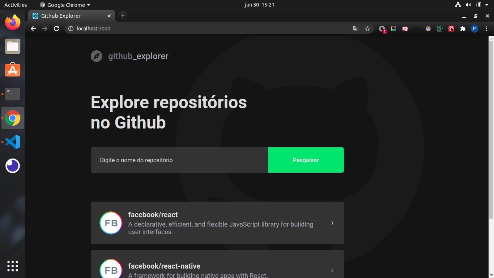
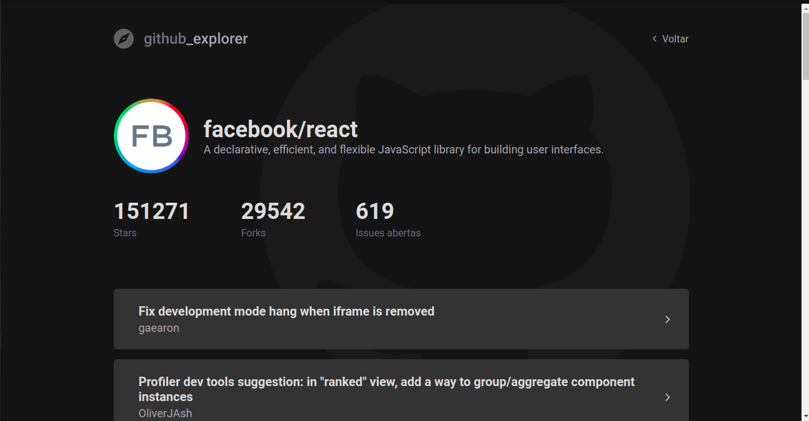
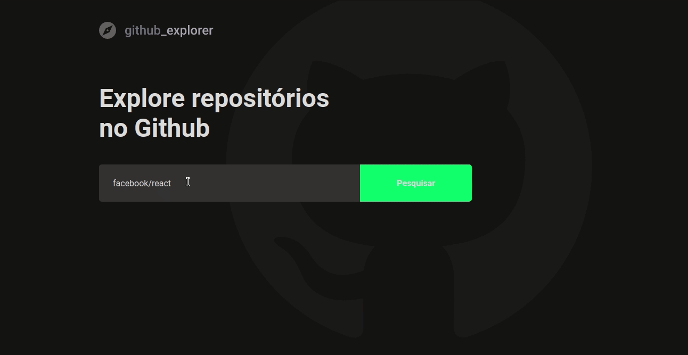

# 🚀 Github Explorer

## 🔖 Sobre

Essa aplicação pesquisa repositórios do github, usando a Api do github, e os exibe em tela, ao clicar no repositório é levado a uma página com algumas informações, stars, forks, issues. Ao clicar em uma issue o usuário é levado a ela.

## 📷 Screenshot:

💻 Adicionei um tema diferente para a página.

    
    
    

# 🚀 Tecnologias
<ul>
    <li>✔️ ReactJS</li>
    <li>✔️ Api do github</li>
    <li>✔️ Axios</li>
    <li>✔️ Styled Components</li>
</ul>

# 

<h3 align="center"> Made with 💜 by <a href="https://www.linkedin.com/in/pedro-lucas-4b2941199/">Pedro Lucas</a></h3>